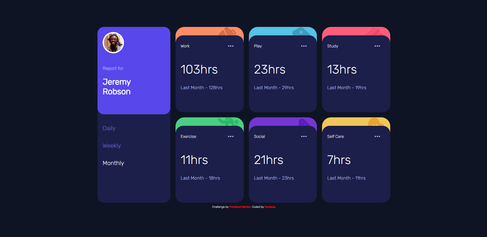

# Frontend Mentor - Time tracking dashboard solution

This is a solution to the [Time tracking dashboard challenge on Frontend Mentor](https://www.frontendmentor.io/challenges/time-tracking-dashboard-UIQ7167Jw). It involves building a responsive time tracking dashboard according to a provided design.

## Table of contents

- [Overview](#overview)
  - [The challenge](#the-challenge)
  - [Screenshot](#screenshot)
  - [Built with](#built-with)
  - [What I learned](#what-i-learned)
  - [Demo](#Demo)

## Overview

This project highlights my skills in creating an interactive and responsive website. The primary challenge involved implementing dynamic time frame displays based on user interactions. Additionally, I gained valuable experience working with JSON data for the first time.

### The challenge

Users should be able to:

- A responsive layout that adapts to different screen sizes.
- Handling JSON data and integrating it into JavaScript.
- The ability to switch between viewing Daily, Weekly, and Monthly statistics.
- Updating the text for the previous period's time based on the selected timeframe (e.g., "Yesterday - 2hrs" for Daily).

### Screenshot

**Desktop Layout:

**Mobile Layout:

### Built with

- Semantic HTML5 markup
- CSS
- Flexbox and CSS Grid for layout.
- Javascript

### What I learned

This project allowed me to further develop my skills in responsive web design and frontend development. Some key takeaways include:

- Improved understanding of CSS layout techniques, such as Flexbox and CSS Grid.
- Enhanced proficiency in responsive design to ensure optimal viewing on various devices.
- Practice in handling user interactions using JavaScript.
- Handling JSON data and integrating it into JavaScript.

## Demo 
You can check out a live demo of this website [here](https://xcordeva.github.io/FrontEndMentor-Challenges/Time-Tracking-Dashboard/).

